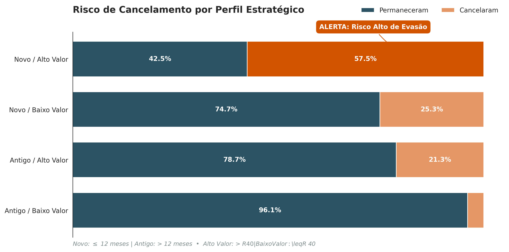

# 📊 Projeto TelecomX: Inteligência de Dados contra a Evasão de Clientes

**Analista Responsável:** Tânia Mara F. de Andrade  
[](https://www.linkedin.com/in/taniamara13) [](https://github.com/taniamara13)

---


## 📌 1. Visão Geral e Objetivo
Este projeto foi desenvolvido como parte do **Desafio Parte 1 do Programa ONE (Oracle Next Education)**. 

No contexto da **Telecom X**, empresa que enfrenta um alto índice de cancelamentos, este trabalho foca na análise do "Churn de Clientes". O objetivo central é identificar os fatores que levam à perda de clientes, servindo como fundação técnica para estratégias de retenção e futuros modelos preditivos.

## 🛠️ 2. Pipeline de Dados (Processo ETL)
Para transformar dados brutos em inteligência estratégica, foi implementado um pipeline estruturado:

1. **Extração:** Consumo de dados via API em formato JSON.
2. **Transformação:** Desaninhamento de estruturas complexas (Flattening), limpeza e padronização de tipos.
3. **Carga e Análise:** Estruturação para geração de visualizações e extração de insights.

## 📈 3. Análise de Churn e Insights Principais
A análise revelou que o perfil de **"Novo / Alto Valor"** possui a maior taxa de evasão, gerando prejuízo direto no Custo de Aquisição de Cliente (CAC).

<div align="left">
  
</div>

## 💡 4. Recomendações Estratégicas
* **Fidelização por Serviços:** Promoção de cross-selling de segurança para aumentar a percepção de valor.
* **Subsídio de Maturação:** Benefícios no primeiro ano para transpor a janela crítica de evasão.
* **Monitoramento Ativo:** Alertas de CRM para intervenções proativas em clientes de alto ticket.

## 🚀 5. Como Executar
```bash
git clone [https://github.com/taniamara13/ONE-TelecomX-Challenge-Churn-Analysis.git](https://github.com/taniamara13/ONE-TelecomX-Challenge-Churn-Analysis.git)
